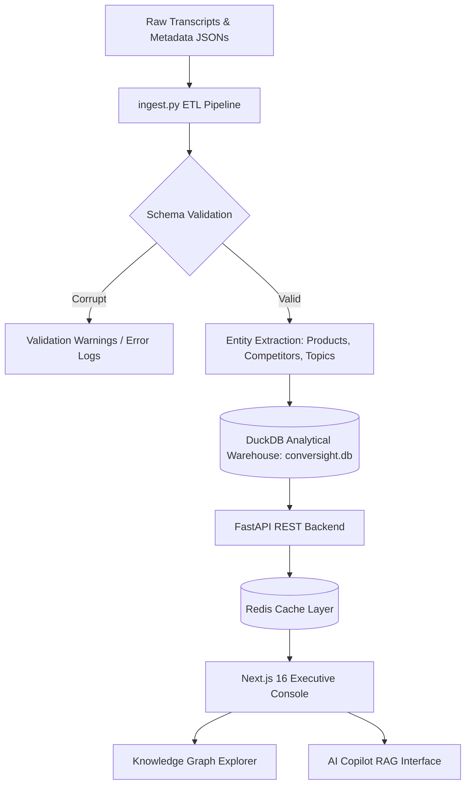

# ConverSight AI — Conversation Intelligence Platform

ConverSight AI is a production-grade, containerized Conversation Intelligence Platform built for B2B enterprise SaaS leaders. It ingests customer support tickets, CS renewals, and internal team recordings, running them through a validation, normalization, and semantic enrichment pipeline. The platform computes customer risk scores, prioritizes product backlogs, maps discussed networks into a force-directed Knowledge Graph, and provides an interactive AI Copilot RAG chat.

---

## 🚀 System Architecture & Data Flow



---

## 🌟 Key Features

1. **Executive Overview Dashboard**: Real-time metrics tracking overall sentiment, total meetings, and call duration alongside weekly health trends.
2. **Proactive Churn Prediction**: Aggregates meeting scores and CS call volumes to flag high-risk accounts (e.g. *Summit Trust*, *Northstar Pharma*).
3. **Product Risk Heatmap**: Scans transcripts to prioritize developer backlogs by separating repeating bugs (like SSO login issues) from prioritized feature requests.
4. **Competitor Win-Loss Tracking**: Automatically extracts mentions of competitors (Okta, Microsoft Entra, Duo, Ping) to map market share threats.
5. **Interactive Knowledge Graph**: Models nodes (Meetings, Products, Competitors, Speakers, Topics) and edges, running a dynamic particle physics simulation loop on HTML5 Canvas.
6. **RAG-Powered AI Copilot**: Answers natural language questions using hybrid BM25 and vector search retrieval, grounding responses in transcript context with bracketed citations (powered by Gemini 1.5 Flash or offline fallbacks).
7. **Interactive Action Center**: Automatically extracts meeting tasks and deadlines, allowing users to modify states (Open, Closed, Blocked) directly in the UI.

---

## 🛠️ Technology Stack Rationale

* **Database**: **DuckDB** acts as an in-process, columnar OLAP database, executing analytical aggregates and FTS token searches in sub-milliseconds without server overhead.
* **Cache**: **Redis** provides external cache consistency across multiple concurrent FastAPI Uvicorn workers with automatic TTL invalidations.
* **Backend**: **FastAPI** leverages async python concurrency and Pydantic validation schemas.
* **Frontend**: **Next.js 16 (React 19)** styled with slate-dark glassmorphism, responsive TailwindCSS, and strict type compiler checking.

---

## 📦 Quick Start Guide

The application is fully containerized inside a multi-service Docker stack.

### Prerequisites
* Docker and Docker Compose installed.
* (Optional) `GEMINI_API_KEY` set in a `.env` file in the root directory for live RAG responses.

### Step 1: Spin up the Docker Compose Stack
From the project root directory, run:
```bash
docker compose up --build -d
```
* This command will spin up the Next.js frontend, FastAPI backend, and Redis cache. 
* The backend container will automatically run DB initialization schemas, process the raw transcript folder, and populate the DuckDB database.

### Step 2: Access the Services
* **Next.js Console**: `http://localhost:3000`
* **FastAPI Server**: `http://localhost:8000`
* **OpenAPI (Swagger) Docs**: `http://localhost:8000/docs`

### Step 3: Tear Down
To stop and clean up the containers:
```bash
docker compose down
```

---

## 🧪 Testing and Verification
The backend maintains a comprehensive suite of unit tests. To run tests inside your local environment:
```bash
# Setup virtual environment
source venv/bin/activate
pip install -r backend/requirements.txt

# Run pytest
PYTHONPATH=backend pytest backend/tests/test_backend.py
```
* **Coverage**: Verifies API endpoint health, DuckDB table constraints, full-text keyword searches, RAG schema citations, and knowledge graph neighborhood traversal.

---

## 📂 Repository Structure
```
├── backend/
│   ├── data/                 # DuckDB persistent storage (conversight.db)
│   ├── database/             # Database initialization schemas (schema.py)
│   ├── ingestion/            # Dataset parsing & ETL pipeline (ingest.py)
│   ├── rag/                  # Hybrid FTS search & Gemini REST client (search.py)
│   ├── tests/                # Pytest unit tests (test_backend.py)
│   ├── Dockerfile
│   └── main.py               # FastAPI entrypoint
├── frontend/
│   ├── app/                  # Next.js App Router (Dashboard, Graph, Copilot pages)
│   ├── public/               # Static icons & vectors
│   └── Dockerfile
├── interview-assignment/     # Raw transcript dataset directories
├── docker-compose.yml        # Docker composition orchestration
├── technical_documentation.md # Detailed engineering architecture guide
├── presentation_script.md    # 30-Minute Slide-by-slide narration guide
├── video_demo_script.md      # Screen recording & manual verification checklist
└── walkthrough.md            # Onboarding walkthrough
```

---

## 📖 Additional Resources
For more details on the platform operations and presentation, consult the following local files:
* **[Onboarding Walkthrough](file:///Users/nikola/Downloads/ConverSight%20AI/walkthrough.md)**: Standard setup overview.
* **[Technical Documentation](file:///Users/nikola/Downloads/ConverSight%20AI/technical_documentation.md)**: Deep-dive architecture and tech stack choices.
* **[Presentation Narration Script](file:///Users/nikola/Downloads/ConverSight%20AI/presentation_script.md)**: Mapped guide for the 30-minute panel presentation.
* **[Video Demo Script](file:///Users/nikola/Downloads/ConverSight%20AI/video_demo_script.md)**: Walkthrough script for your 5-minute video demonstration.
