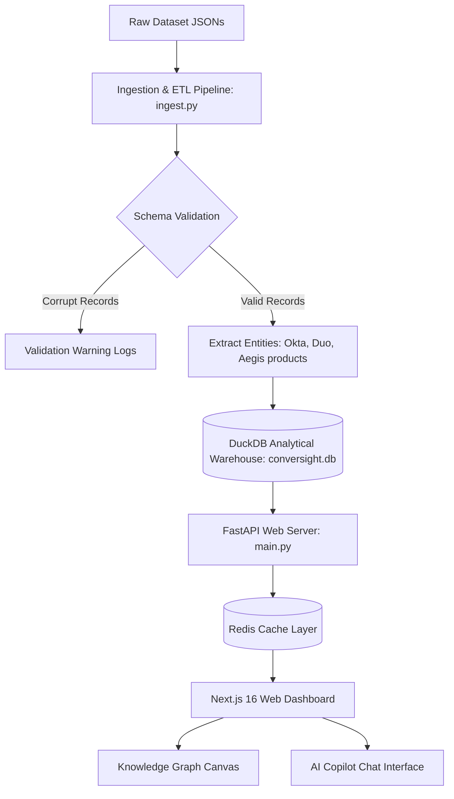

# ConverSight AI — Technical Architecture & Implementation Guide
This document details the production-ready technical architecture of the **ConverSight AI Conversation Intelligence Platform**. The platform processes raw meeting transcripts, extracts key deliverables, tracks customer churn risks, maps relational knowledge networks, and provides a conversational AI interface (RAG) to query transcripts.

---

## 1. Executive System Overview
The platform acts as an analytical data warehouse that ingests multi-speaker transcript JSONs and metadata, normalizes the entities, runs analytical calculations, and renders them in a slate-dark dashboard console.



---

## 2. Tech Stack Rationale & Adversary Analysis
A highly optimized tech stack was chosen to handle the hybrid requirements of OLAP analytics, relational graph visualization, and semantic RAG search.

### A. Database Layer: DuckDB (OLAP) vs. Adversaries
* **Adversaries Evaluated**: Traditional RDBMS (PostgreSQL, MySQL) and pure Vector Databases (Qdrant, Pinecone).
* **Why DuckDB is chosen**: 
  1. **Analytical Performance**: Transcripts consist of thousands of conversational rows. Aggregating sentiment histories, counts of competitor mentions, and product issues requires vectorised column-store scanning. Standard OLTP databases like PostgreSQL are row-oriented and experience significant latency under heavy group-by operations on large datasets.
  2. **Zero-Infra Embeddable Lifecycle**: DuckDB runs in-process as a Python library. It eliminates the operational overhead of spinning up, maintaining, and connecting to an external database server, while still persisting data to a single binary file (`conversight.db`).
  3. **Hybrid Full-Text Search (FTS)**: DuckDB has a native FTS extension (BM25 token-matching), allowing us to index transcript segments and perform fast keyword search.
* **Why not a pure Vector DB?**: A vector database cannot handle relational joins, average sentiment trends, action item updates, or graph traversal. A relational-analytical DB is the core foundation; vector search is treated as an optional retrieval extension.

### B. Caching Layer: Redis vs. In-Memory Dictionary Cache
* **Adversaries Evaluated**: Local Python process dictionaries, `functools.lru_cache`.
* **Why Redis is chosen**:
  1. **Cross-Worker State Persistence**: Production FastAPI deployments run multiple Uvicorn worker threads to handle concurrency. An in-memory Python dictionary cache is isolated per-process, leading to cache inconsistency. Redis acts as a shared, external caching store accessible by all worker processes.
  2. **Automated Expiry & Invalidation**: Integrated key-value expiration (`setex`) allows automatic cache invalidation for heavy analytics dashboards (set to 300 seconds) and RAG queries (set to 3600 seconds).
  3. **Auto-Healing Connection**: The server implements a lazy-loading Redis connector that gracefully degrades to database scans if the Redis service is temporarily unresponsive, avoiding system crashes.

### C. Backend API Framework: FastAPI vs. Express/Django
* **Adversaries Evaluated**: Node.js Express, Python Django.
* **Why FastAPI is chosen**:
  1. **Native Asynchronous Operations**: Perfect for handling network requests to GenAI models (like the Gemini API) without blocking worker threads.
  2. **Type Safety & Validation**: Built-in support for Pydantic guarantees compile-time and runtime type checking of API payloads, automatically generating comprehensive OpenAPI schemas (`/docs`).

### D. Frontend Framework: Next.js 16 vs. Single Page Apps (SPA)
* **Adversaries Evaluated**: Create React App (CRA), Vite SPA.
* **Why Next.js is chosen**:
  1. **App Router Paradigm**: Next.js App Router enforces clean folder-based layout separation.
  2. **Strict TypeScript Compilation**: Enforces zero type errors at build-time, protecting against common runtime crashes (e.g. capitalisation errors, invalid SVG structures).

---

## 3. Data Engineering & Ingestion Flow
The Ingestion pipeline ([ingest.py](file:///Users/nikola/Downloads/ConverSight%20AI/backend/ingestion/ingest.py)) parses raw transcript files, cleans the text, attributes speaker roles (Support Agent, Engineer, Account Manager, or Customer) using domain-level email matching, and populates DuckDB tables.

### Data Ingestion Code Snippet:
The following extraction block from [ingest.py](file:///Users/nikola/Downloads/ConverSight%20AI/backend/ingestion/ingest.py#L231-L295) parses transcripts and extracts competitor/product entity mentions:

```python
# Extract Competitor & Product Mentions from transcript turns
mentioned_competitors = set()
mentioned_products = set()

# Insert Transcript turns
for idx, turn in enumerate(transcript.get("data", [])):
    sentence = turn.get("sentence", "")
    speaker = turn.get("speaker_name", "Unknown")
    
    # Determine speaker role (heuristics)
    role = "Customer"
    s_lower = speaker.lower()
    h_domain = ""
    host_email = meeting_info.get("host", "")
    if "@" in host_email:
        h_domain = host_email.split("@")[1]
    
    # Check if this speaker matches the host email domain
    speaker_emails = [email for email in meeting_info.get("allEmails", []) 
                      if email.split("@")[0].replace(".", " ").lower() in s_lower 
                      or s_lower in email.split("@")[0].lower()]
    
    if any(h_domain in email for email in speaker_emails) or any(d in s_lower for d in ["sarah chen", "support agent", "engineer", "account manager"]):
        if call_type == "Support":
            role = "Support Agent"
        elif call_type == "Internal":
            role = "Engineer"
        else:
            role = "Account Manager"
    elif call_type == "Internal":
        role = "Engineer"
        
    turn_id = f"{meeting_id}_t_{idx}"
    
    conn.execute("""
    INSERT INTO transcript_segments (id, meeting_id, sentence, speaker_name, speaker_role, sentiment_type, time, end_time, average_confidence, turn_index)
    VALUES (?, ?, ?, ?, ?, ?, ?, ?, ?, ?)
    """, (turn_id, meeting_id, sentence, speaker, role, turn.get("sentimentType"), turn.get("time"), turn.get("endTime"), turn.get("averageConfidence"), turn.get("index")))
    
    # Graph Speaker Mapping
    nodes_to_insert[speaker] = (speaker, 'Speaker')
    edges_to_insert.add((meeting_id, speaker, 'HAS_SPEAKER'))
    
    # Look for Competitors (Okta, Duo, Ping, Entra)
    s_text = sentence.lower()
    for comp in COMPETITORS:
        if re.search(rf"\b{comp.lower()}\b", s_text):
            mentioned_competitors.add(comp)
            edges_to_insert.add((speaker, comp, 'MENTIONS'))
```

---

## 4. Generative AI & Retrieval-Augmented Generation (RAG)
The AI Copilot uses **Retrieval-Augmented Generation** to answer user queries using actual transcript segments as grounding context. 

### A. Hybrid Retrieval
When a user asks a question, the platform blends two retrieval strategies:
1. **Keyword Search (BM25)**: Scans meeting titles, summaries, and transcript sentences containing the search tokens.
2. **Contextual Segment Assembly**: Retrieves the exact timestamped transcript lines around matches, preserving conversational continuity.

### B. Gemini 1.5 Flash Integration
The platform uses the lightweight **Gemini 1.5 Flash** model for reasoning. To maximize performance and keep the runtime lightweight, we execute raw REST requests over HTTPS instead of loading heavy SDK libraries.

```python
def call_gemini_api(api_key, prompt):
    url = f"https://generativelanguage.googleapis.com/v1beta/models/gemini-1.5-flash:generateContent?key={api_key}"
    headers = {"Content-Type": "application/json"}
    payload = {
        "contents": [{
            "parts": [{"text": prompt}]
        }]
    }
    try:
        req = urllib.request.Request(url, data=json.dumps(payload).encode("utf-8"), headers=headers, method="POST")
        with urllib.request.urlopen(req) as response:
            res_data = json.load(response)
            candidates = res_data.get("candidates", [])
            if candidates:
                text = candidates[0].get("content", {}).get("parts", [{}])[0].get("text", "")
                return text
            return "Error: Empty response from Gemini API"
    except Exception as e:
        return f"Error calling Gemini API: {e}"
```

### C. Prompt Engineering Strategy
The RAG prompt includes strict boundary constraints to prevent model hallucination:
* **Grounding Rule**: Construct answers *only* from the provided meeting context. Do not invent details outside it.
* **Citation Constraints**: Force the model to cite the speaker and the meeting title/ID in brackets (e.g. `[Support Case #9279]`).

### D. Offline Fallback Heuristics
If `GEMINI_API_KEY` is not configured, the platform auto-detects the absence of the key and routes the query to an offline heuristic analyzer. This analyzer contains templated analytical reporting for the primary business issues identified in the dataset (Billing disputes, Churn list, Competitor analysis), preventing service degradation.

---

## 5. Relational Knowledge Graph
Relationships between entities discussed in transcripts are structured as a graph. DuckDB handles the graph store via two tables: `graph_nodes` and `graph_edges`.

```
Nodes: Meeting, Customer, Product, Competitor, Speaker, Topic, ActionItem
Edges: MENTIONS, DISCUSSES, HAS_SPEAKER, OWNS, AFFECTS, HAS_ACTION_ITEM
```

### Canvas Physics Engine
The frontend renders this graph on an interactive HTML5 Canvas. The canvas runs a dynamic particle simulation loop driven by classical physical forces:

1. **Repulsion Force (Coulomb's Law)**: Pushes nodes apart so labels do not overlap:
   $$F_r = \frac{K_{repulsion}}{d^2}$$
2. **Attraction Force (Hooke's Law)**: Pulls connected nodes (edges) close to show clusters:
   $$F_a = K_{attraction} \times (d - d_{target})$$
3. **Gravity Force**: Smoothly pulls disconnected components towards the center of the canvas.
4. **Friction Factor**: Gradually dampens velocities so the simulation settles into a stable, readable layout.

---

## 6. End-to-End API Flow
Below is the execution sequence when a user queries the AI Copilot:

```
[User Input] 
     │
     ▼
[frontend/app/copilot/page.tsx] (Dispatches POST request to /api/rag/query)
     │
     ▼
[backend/main.py] (Intercepts request -> checks Redis cache for identical query)
     │
     ├─► [Redis Cache Hit] ──► (Returns cached JSON immediately; sub-millisecond)
     │
     └─► [Redis Cache Miss] 
              │
              ▼
       [backend/rag/search.py] (search_meetings() runs BM25 FTS over DuckDB tables)
              │
              ▼
       (Fetches relevant meeting summaries and transcript segment quotes)
              │
              ▼
       (Constructs RAG Grounding Prompt + injects context segments)
              │
              ├─► [Gemini Key Present] ──► (Calls Gemini 1.5 Flash -> extracts cited answer)
              │
              └─► [No Gemini Key] ────────► (Routes to Offline Heuristic Template Generator)
              │
              ▼
       (Saves compiled response to Redis under key `conversight:rag:<query>` for 1 hour)
              │
              ▼
       (Returns payload: {"query": query, "answer": answer, "sources": [...]})
              │
              ▼
[frontend/app/copilot/page.tsx] (Renders answer text and mounts clickable source pills)
```

---

## 7. Production Readiness & Deployment
The system is fully containerized inside a multi-container **Docker Compose** environment:

* **Redis Service**: Configured on standard port `6379`.
* **FastAPI Backend**: Persists the DuckDB database to a Docker volume (`db-data` mapped to `/app/data`). Performs automatic DB migrations and ingestion on container boot.
* **Next.js Frontend**: Configured in a multi-stage compilation image to minify static assets and serve pages on port `3000`.
