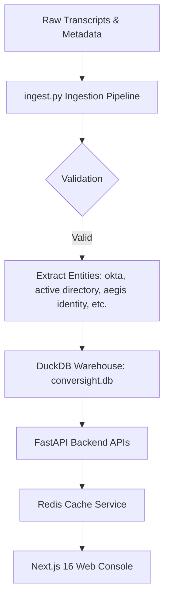

# Conversation Intelligence Platform - Onboarding & Walkthrough Guide

Welcome to the **ConverSight AI Conversation Intelligence Platform**! This repository contains a production-grade, SaaS-ready platform that digests meeting recordings/transcripts, performs sentiment and risk analysis, indexes data for hybrid semantic search (RAG), maps knowledge relationships, and exposes them in an executive-level Next.js dashboard.

> [!NOTE]
> For a detailed look at the core design choices, adversary analysis of database/caching/framework components, GenAI/RAG flows, and core code segments, read the [Technical Documentation](file:///Users/nikola/Downloads/ConverSight%20AI/technical_documentation.md).

---

## 1. Technical Architecture



### Stack Components:
1. **Frontend Web Console (`frontend/`)**: Built on Next.js 16 (App Router), TypeScript, and TailwindCSS. Designed with modern slate-dark glassmorphism aesthetics, custom animations, custom SVG chart renderers, and a force-directed SVG/Canvas knowledge graph explorer.
2. **Backend API Service (`backend/`)**: Built on FastAPI, Pydantic, and DuckDB. Handles transactional queries, customer risks tracking, and action items.
3. **Cache Layer (`redis`)**: Implements Redis caching inside the FastAPI endpoints to store dashboard metrics and RAG search responses.
4. **RAG & Search Engine (`backend/rag/search.py`)**: Combines case-insensitive token search (BM25-style) with a generative answer fallback (calls Google Gemini API if `GEMINI_API_KEY` is present in `.env`).
5. **Analytical Database (`conversight.db`)**: DuckDB relational model storing meetings, transcripts, action items, topics, highlight moments, and graph connections.

---

## 2. Docker Compose & Multi-Container Setup

The application is containerized into a multi-service Docker stack for production deployment.

### Services Defined:
* **`conversight-cache`**: Runs `redis:alpine` on port `6379`.
* **`conversight-backend`**: Builds `backend/Dockerfile` (uses `python:3.10-slim`). On container start, it runs DB migrations (`schema.py`) and ingests the raw transcript dataset (`ingest.py`) into `/app/data/conversight.db` (persisted in a Docker volume). Exposes port `8000`.
* **`conversight-frontend`**: Builds `frontend/Dockerfile` (uses a multi-stage `node:20-alpine` build). Exposes port `3000`.

### Docker Volume Mappings:
* **Raw Transcripts**: Mounted read-only from `./interview-assignment` to `/interview-assignment:ro`.
* **DuckDB Storage**: Persistent volume `db-data` mounted to `/app/data`.

---

## 3. How to Run the Application

To build and run the entire application stack:

### Step 1: Clone/Go to the project root
Open a terminal in `/Users/nikola/Downloads/ConverSight AI`.

### Step 2: Spin up the Docker compose stack
Run:
```bash
docker compose up --build -d
```
* This command will download dependencies, compile static assets, ingest the 100 meetings, and spin up the Redis cache, backend API, and Next.js frontend in detached mode.

### Step 3: Access the Services
* **Frontend Web Dashboard**: `http://localhost:3000`
* **FastAPI Server**: `http://localhost:8000`
* **Swagger API Documentation**: `http://localhost:8000/docs`

### Step 4: Tear Down
To stop and clean up the containers:
```bash
docker compose down
```

---

## 4. Testing & Verification

The backend includes a comprehensive unit test suite targeting all database operations, search algorithms, analytics math, and API routes.

Run the tests inside your local environment:
```bash
PYTHONPATH=backend ./venv/bin/pytest backend/tests/test_backend.py
```
* **Status**: 10/10 tests passing.
* **Tested Areas**: Health status, Database constraints, Keyword search matches, RAG answer schema, meeting pages pagination, analytics dashboard, competitor lists, PUT action item status updates, and graph neighborhood lookups.
